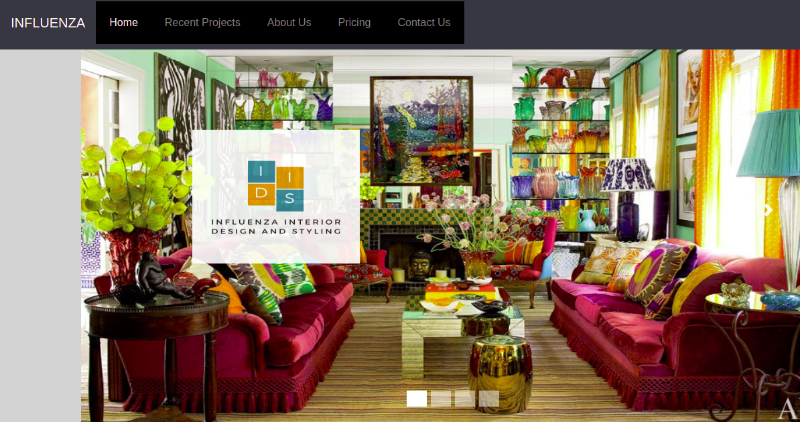

# **INTERIOR-DESIGN-WEBSITE**
#### This is a project on Interior-Design-Website known as INFLUENZA.
 
 ***Thursday September 23 2021*** 
## By:  
* **VALENTINE OCHIENG**  
* **SOLOMON SITATI** 
* **ALPHONCE ODHIAMBO** 
* **LEVY OMOLO**

## Description
This website allows the customers to:

* Request a quatation of the interior design service of their houses or rooms.
* View few sample of the already designed projects and speculate the possible outcome.
* Order or request for the service.
* Make payments electronically via M-Pesa, PayPal, or Mastercards.
* See and access our location in case they be in need of one-on-one discussions.
* See the feedbacks from customers of similar products and services.
* Give feedback on the service received.

## Project live site
  This is the live [ link](https://valentine-ochieng.github.io/Interior-Design-Website/).

### This is the homepage demo.
  

## Setup instructions
* Clone the program from [Online repo](https://github.com/valentine-ochieng/Interior-Design-Website)
* Click on the green button to clone or download

## Technologies Used
* HTML
* CSS
* Bootsrap
* JQuery
* Javascript

## Support and contact details
Contact us @:
* valentine.ochieng@student.moringaschool.com
* solomon.sitati@student.moringaschool.com
* alphonce.odhiambo@student.moringaschool.com
* omololevy@gmail.com 
### License
The project is under [MIT license](https://github.com/valentine-ochieng/Interior-Design-Website/blob/main/LICENSE) 
Copyright &copy; 2021. All rigths reserved.
  